# 16 Web Safe Fonts to use with CSS

Here are examples of "Web Safe" that are extremely common on most versions of Windows, Mac, Linux etc.

---


```css
   font-family: Impact, Charcoal, sans-serif;
```

---

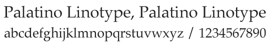
```css
font-family: "Palatino Linotype", ‘Book Antiqua’, Palatino, serif;
```

---

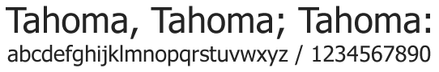
```css
font-family: Tahoma, Geneva, sans-serif;
```

---

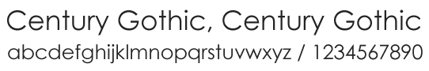
```css
font-family: Century Gothic, sans-serif;
```

---


```css
font-family: "Lucida Sans Unicode", "Lucida Grande", sans-serif;
```

---

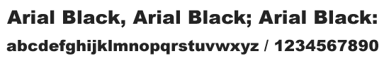
```css
font-family: "Arial Black", Gadget, sans-serif;
```

---

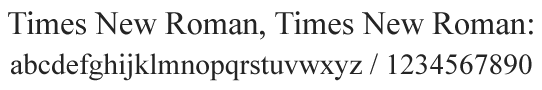
```css
font-family: "Times New Roman", Times, serif;
```

---

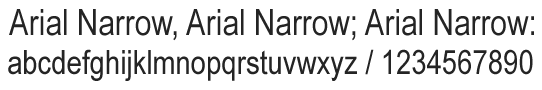
```css
font-family: "Arial Narrow", sans-serif;
```

---

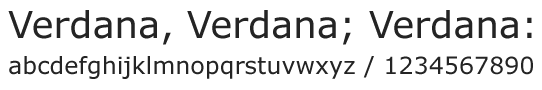
```css
font-family: Verdana, Geneva, sans-serif;
```

---

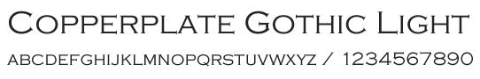
```css
font-family: Copperplate / Copperplate Gothic Light, sans-serif;
```

---


```css
font-family: "Lucida Console", Monaco, monospace;
```

---

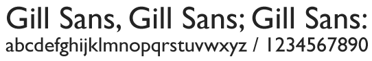
```css
font-family: Gill Sans / Gill Sans MT, sans-serif;
```

---

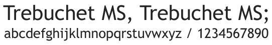
```css
font-family: "Trebuchet MS", Helvetica, sans-serif;
```

---

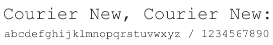
```css
font-family: "Courier New", Courier, monospace;
```

---

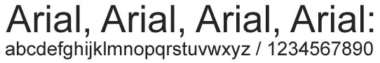
```css
font-family: Arial, Helvetica, sans-serif;
```

---

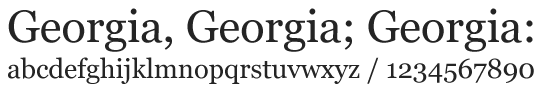
```css
font-family: Georgia, Serif;
```